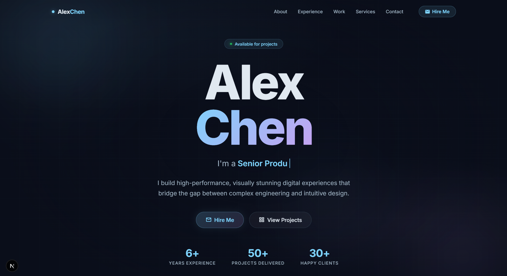

# GlacierPortfolio — Futuristic Developer Portfolio Template



> A premium, single-page developer portfolio built with **Next.js 16**, **React 19**, and **TypeScript**. Featuring the *Glacier Glassmorphism* design system — dark, atmospheric, and visually stunning.

---

## 🌟 Features

- **Glacier Glassmorphism Design** — deep navy background with layered translucent panels, ice-blue accents, and soft glow effects
- **Typewriter Hero Animation** — smooth character-by-character role text cycling
- **Scroll-Aware Navbar** — transparent → frosted glass on scroll, with active section highlighting
- **Filterable Project Grid** — category-based filter with animated card transitions
- **Timeline Experience Section** — work history, education & certification cards
- **Animated Orbs & Grid Overlay** — cinematic hero background
- **Contact Form** — glass-styled form with HTML5 validation and success feedback
- **Fully Responsive** — mobile-first, tested at 375px, 768px, 1280px+
- **CSS Modules** — zero style conflicts, fully scoped, no Tailwind dependency
- **Google Inter Font** — modern, clean typography via `next/font`
- **Material Icons** — no icon library install needed
- **SEO Optimized** — title, meta description, OpenGraph, semantic HTML

---

## 📁 Project Structure

```
portfolio1/
├── app/
│   ├── layout.tsx              # Root layout — metadata, fonts, icons
│   ├── page.tsx                # Main page — assembles all sections
│   ├── globals.css             # Design tokens, animations, utilities
│   └── components/
│       ├── Navbar.tsx          # Fixed nav, glass scroll, mobile menu
│       ├── Hero.tsx            # Full-viewport hero + typewriter
│       ├── About.tsx           # Bio, tech stack tags, trait cards
│       ├── Experience.tsx      # Timeline, education, certifications
│       ├── Work.tsx            # Filterable project grid
│       ├── Services.tsx        # Service cards with feature lists
│       ├── Testimonials.tsx    # Quote cards
│       ├── Contact.tsx         # Info + contact form
│       └── Footer.tsx          # Brand mark, socials, copyright
├── public/                     # Static assets (favicon, OG image)
├── next.config.ts
├── tsconfig.json
├── package.json
└── README.md
```

---

## 🚀 Getting Started

### Requirements

- Node.js `18.x` or higher
- npm `9.x` or higher

### Installation

```bash
# 1. Install dependencies
npm install

# 2. Start development server
npm run dev
```

Open [http://localhost:3000](http://localhost:3000) in your browser.

### Build for Production

```bash
npm run build
npm run start
```

---

## ✏️ Customization Guide

### 1 — Personal Info (Hero)

Edit `app/components/Hero.tsx`:

```tsx
const roles = [
  "Senior Product Engineer",   // ← change these
  "UI/UX Architect",
  "Full-Stack Developer",
  "Creative Technologist",
];
```

### 2 — About Section

Edit `app/components/About.tsx`:
- Replace bio paragraphs with your own text
- Update tech stack tags array

### 3 — Work Experience & Education

Edit `app/components/Experience.tsx`:
- Update the `jobs` and `education` arrays
- Add/remove certification cards in `certs`

### 4 — Projects

Edit `app/components/Work.tsx`:
- Update the `projects` array — title, description, tags, accent color, icon, category

### 5 — Services

Edit `app/components/Services.tsx`:
- Update `services` array with your own offerings

### 6 — Testimonials

Edit `app/components/Testimonials.tsx`:
- Update `testimonials` array

### 7 — Contact Info

Edit `app/components/Contact.tsx`:
- Replace email, location, and social links
- To wire up a real backend: replace the `handleSubmit` function with an API call to Resend, Nodemailer, or EmailJS

### 8 — Colors & Design Tokens

All colors live in `app/globals.css` under `:root {}`:

```css
:root {
  --primary: #7dd3fc;      /* ice-blue accent */
  --tertiary: #c8a0f0;     /* lavender gradient pair */
  --background: #0a0e1a;   /* deep navy base */
  /* etc… */
}
```

Change `--primary` and `--background` to instantly rebrand the entire site.

### 9 — Metadata & SEO

Edit `app/layout.tsx`:

```tsx
export const metadata: Metadata = {
  title: "Your Name — Your Title",
  description: "Your custom meta description.",
};
```

---

## 🎨 Design System — Glacier

| Token | Value | Role |
|-------|-------|------|
| `--primary` | `#7dd3fc` | Ice-blue — CTAs, links, accents |
| `--tertiary` | `#c8a0f0` | Lavender — gradient pair |
| `--background` | `#0a0e1a` | Deep navy base |
| `--surface` | `#0f1524` | Card surfaces |
| `--on-surface` | `#e0e8f0` | Primary text |
| `--on-surface-variant` | `#a0b4c4` | Muted / secondary text |

**Glass Card Pattern:**
```css
background: rgba(15, 21, 36, 0.6);
backdrop-filter: blur(16px);
border: 1px solid rgba(125, 211, 252, 0.1);
```

---

## 🛠️ Tech Stack

| Technology | Version | Purpose |
|------------|---------|---------|
| Next.js | 16.2 | Framework, App Router |
| React | 19 | UI rendering |
| TypeScript | 5 | Type safety |
| CSS Modules | — | Scoped component styles |
| Inter (Google Fonts) | — | Typography |
| Material Icons | — | Icon set |

---

## 📦 Submission Notes

- ✅ All placeholder content is realistic and demo-ready
- ✅ Zero third-party UI libraries — only Next.js core
- ✅ CSS Modules — no style conflicts when integrating with buyer's existing code
- ✅ TypeScript throughout — type-safe and maintainable
- ✅ No API keys or secrets anywhere in the code
- ✅ Production build tested with `npm run build`

---

## 💬 Support

For support, customization help, or feature requests — please leave a comment on the ThemeForest item page or reach out via the contact form on our profile.

---

*GlacierPortfolio — Built with precision. Designed to impress.*
